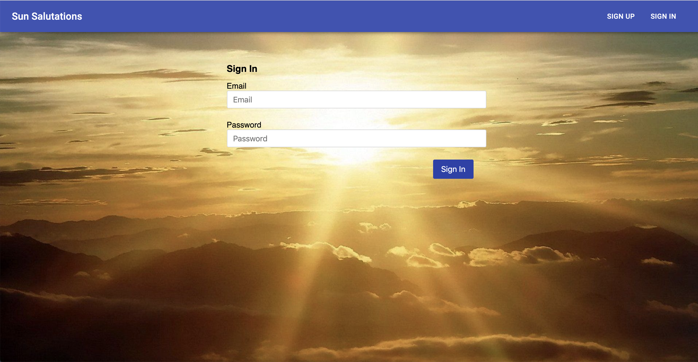

This application was designed and coded by Adam Caplan, as part of a project for General Assembly.

The app is designed to provide an easy and fun way to learn sun salutations, record your practice, and track your progress.

## Instructions
Click the "sign up" tab at the top of the opening screen and fill out the form to create a new login. You will be logged in automatically upon successful sign up. If you already have a login, click the "sign in" tab, and fill out the form to begin.

You can change your password at any time by clicking on the "Change password" tab and filling out the form.

"Show Records" will take you to your practice journal. You can add a new session by clicking on the "+" button at the bottom corner of the screen. Click "edit" and fill out the form to update an entry or click "delete" to remove an entry.

"Rounds tracker" takes you to a counting tool. Each time you complete a round of sun salutations, click on the sun icon, and the counter will increase. When you finish practicing, click "save", and the program will log your progress. Go back to "Show records" and edit the entry (listed under the current date) to add notes - or more rounds if you continue the practice later. "Rounds completed" is the number of sun salutations you performed; "Rounds set" is an optional column for the number of rounds you'd set out to do.

If you're new to the practice of sun salutations, click "Practice" to see the sequence!

Enjoy!!

## Setup and Installation - Instructions for Developers:
To use the program locally, fork and clone the repo. Then install dependencies with the following terminal commands:
- npm install
- npm install @material-ui/core
-npm install styled-components@beta react@^16.8 react-dom@^16.8 react-is@^16.8

## Relevant Links
front end deployed: https://apcaplan.github.io/sun-salutations-client/
back end repo: https://github.com/apcaplan/sun-salutations-rails-api
back end deployed: https://glacial-atoll-65059.herokuapp.com

## Technologies Used
- React.js
- CSS
- JavaScript
- Material-ui

## Wireframe
https://imgur.com/m95yHws

## User Stories
As a user, I want to be able to create an account
As a user, I want to be able to log in
As a user, I want to be able to change my password
As a user, I want to be able to log out
As a user, I want to learn how to do sun salutations
As a user, I want to count the number of rounds I do
As a user, I want to be able to add entries from practice done outside the app
As a user, I want to be able to remove entries
As a user, I want to be able to update entries

## Development process
I began the development process by creating a wireframe, an ERB, and user stories for the app I'd envisioned. Coding started by creating the back end, and then continued with this repo. I created links to the API for all CRUD functions, and developed a table to present all journaled information. Then I created functionality for counting rounds of sun salutations and started to develop a guide for leading users through the sequence of poses that makes up each round of sun salutations. Finally, I worked on styling to improve user experience.

## Future directions
Future iterations of this app will include:
-improved styling
-an option to continue counting sun salutations from where you left off
-a guided practice, with visual and audio options
-a way to set the speed at which you are guided through the poses
-an option to pause between rounds
